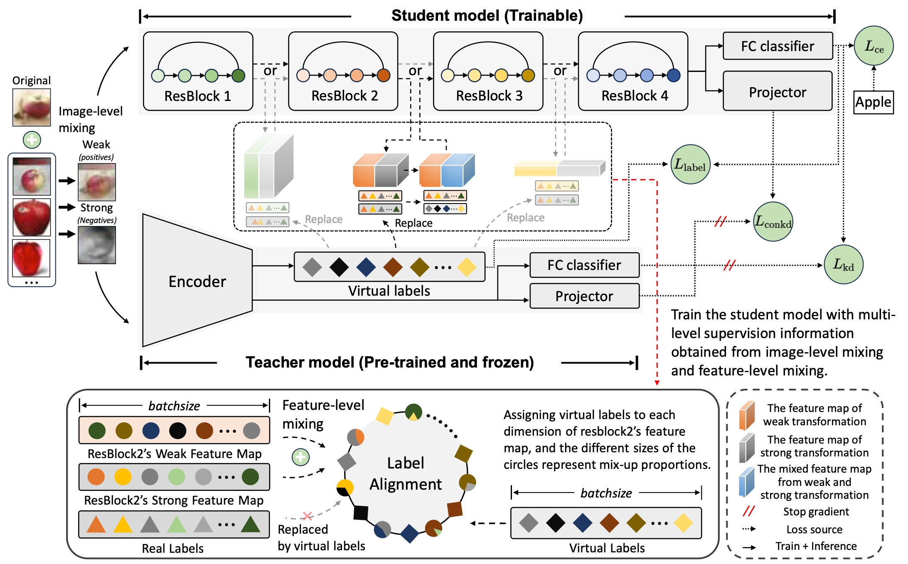

# HMCKD

This repo provides a demo for the paper "Hybrid Mix-up Contrastive Knowledge Distillation" on the CIFAR-100 dataset.

## Requirements
- python 3.7 (Anaconda version >=5.3.1 is recommended)
- torch (torch version >=1.1.0 is recommended)
- torchvision (torchvision version >=0.3.0 is recommended)
- tensorflow-gpu (tensorflow-gpu version >=2.5.0 is recommended)
- pandas
- numpy
- tensorboard_logger
- NVIDIA GPU + CUDA CuDNN

## Datasets
- CIFAR-100, STL-10, Tiny-ImageNet, ImageNet and others

## Getting started
- Download datasets and extract it inside  `data`
- Teacher Training: `train_teacher.py --model wrn_40_2`
- Student Training: `python train_student_hmckd.py --dataset cifar100 --path_t ./save_t/wrn_40_2/ckpt_epoch_240.pth --distill HMCKD --model_s wrn_16_2`
- Evaluate Sample:
  - Distilled model of resnet32x4_resnet8x4, vgg13_vgg8, and wrn_40_2_shufflev1 for CIFAR-100 are available at this [link](https://drive.google.com/file/d/11ZaYnitnq2Vn1w1TlMCCIXIbLjx4d3VT/view?usp=sharing). Download and extract them in the `save_dir` directory.
  - You can achieve the top-1 classification accuracy of 77.99%, 76.28%, and 80.20% on CIFAR-100 datasets.

## Acknowledgement
- Thanks for SSKD and CRD. We build this library based on the [SSKD's codebase](https://github.com/xuguodong03/SSKD) and [CRD's codebase](https://github.com/HobbitLong/RepDistiller).